# SpareFinderAI - Automotive Part Identification Platform

## Overview

SpareFinderAI is a comprehensive SaaS platform that combines AI-powered image recognition with web scraping intelligence to identify automotive spare parts. The application allows users to upload images of auto parts and receive detailed analysis including part identification, pricing, supplier information, and technical specifications.

### Core Value Proposition

- **AI-Powered Recognition**: Leverages OpenAI GPT-4 Vision for intelligent part identification
- **Web Intelligence**: Real-time scraping of supplier websites for pricing and availability
- **Complete Analysis**: Provides technical specifications, compatibility, and purchasing options
- **Enterprise Features**: Subscription-based access with admin panel and user management

## Technology Stack & Dependencies

### Frontend Architecture (React + Vite)

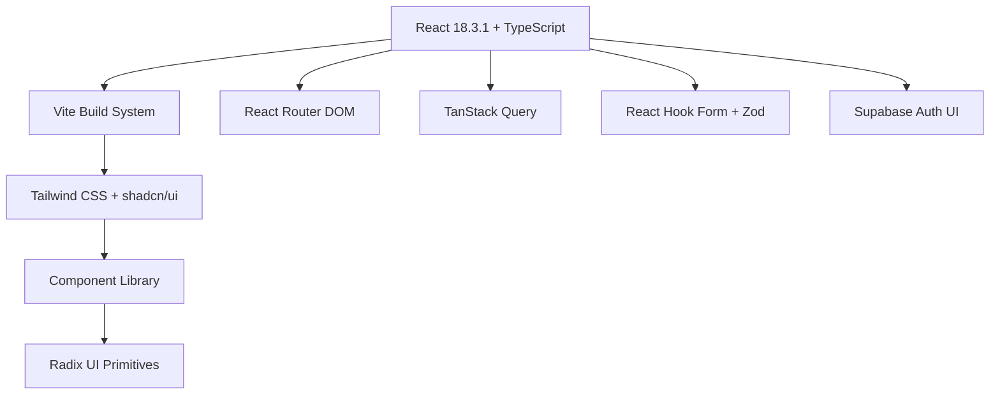

**Core Dependencies:**

- **Build System**: Vite 5.4.19 with React SWC plugin
- **UI Framework**: React 18.3.1 with TypeScript 5.5.3
- **Styling**: Tailwind CSS 3.4.11 + shadcn/ui components
- **State Management**: TanStack React Query 5.56.2
- **Routing**: React Router DOM 6.26.2
- **Forms**: React Hook Form 7.53.0 + Zod 3.23.8 validation
- **Authentication**: Supabase Auth UI React 0.4.7
- **Animation**: Framer Motion 12.17.0

### Backend Architecture (Node.js + Express)

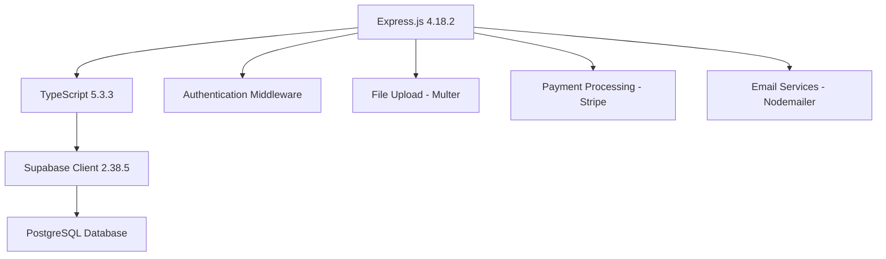

**Core Dependencies:**

- **Framework**: Express.js 4.18.2 with TypeScript
- **Database**: Supabase (PostgreSQL) with Prisma-like client
- **Authentication**: JWT + bcryptjs + Supabase Auth
- **File Handling**: Multer 1.4.5 + Sharp 0.32.6 (image processing)
- **Payment**: Stripe 18.3.0 integration
- **Email**: Nodemailer 6.9.13 with HTML templates
- **Security**: Helmet 7.1.0 + CORS 2.8.5
- **Logging**: Winston 3.17.0 + Morgan 1.10.0

### AI Service Architecture (Python + FastAPI)

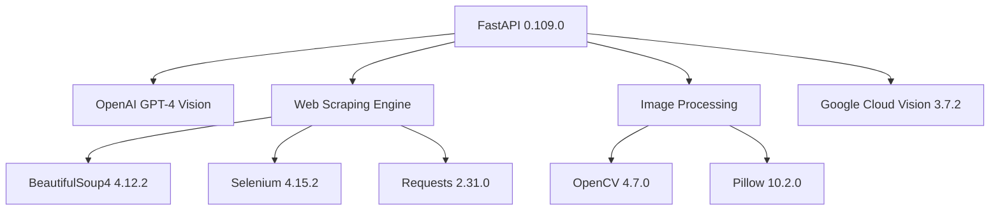

**Core Dependencies:**

- **Framework**: FastAPI 0.109.0 + Uvicorn 0.24.0
- **AI Services**:
  - OpenAI 1.16.1 (GPT-4 Vision)
  - Google Cloud Vision 3.7.2 (backup recognition)
- **Web Scraping Stack**:
  - BeautifulSoup4 4.12.2 (HTML parsing)
  - Selenium 4.15.2 (dynamic content)
  - Requests 2.31.0 + aiohttp 3.9.3 (HTTP clients)
  - CloudScraper 1.2.71 (anti-bot bypass)
  - fake-useragent 1.4.0 (browser simulation)
- **Image Processing**:
  - OpenCV 4.7.0 (computer vision)
  - Pillow 10.2.0 (image manipulation)
  - NumPy 1.24.3 (numerical operations)

## Architecture

### System Architecture Overview

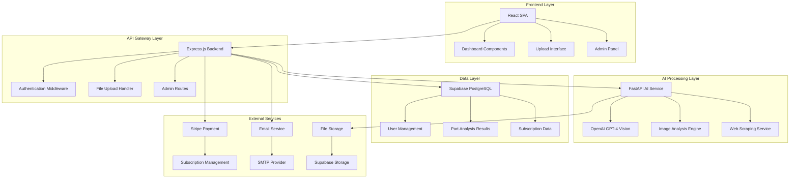

### Component Architecture

#### Frontend Component Hierarchy

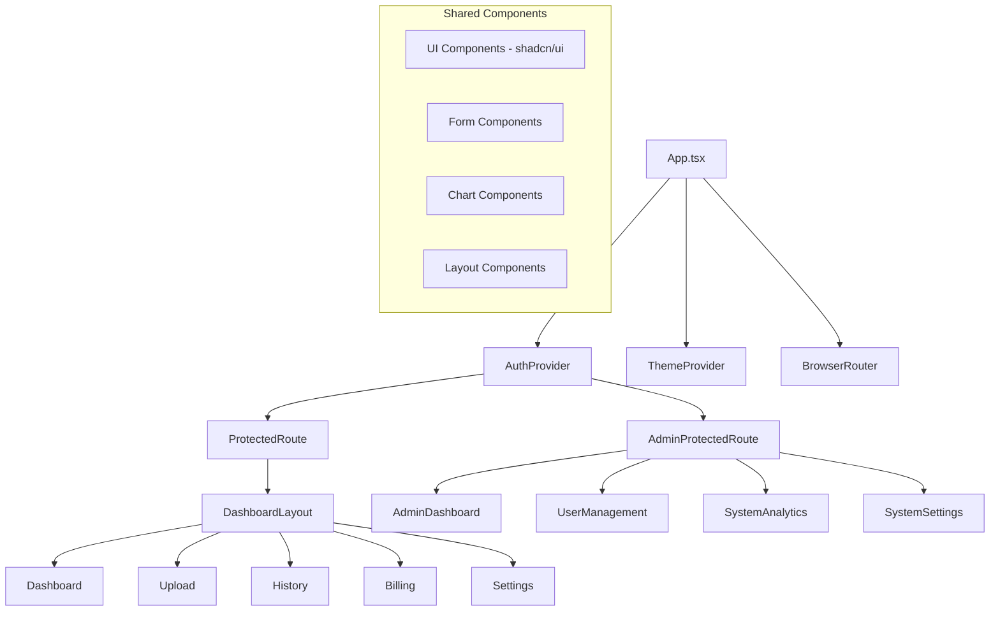

#### Backend Service Architecture

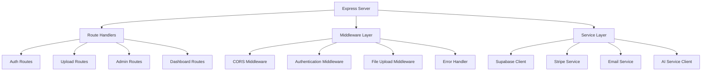

### AI Service Component Architecture

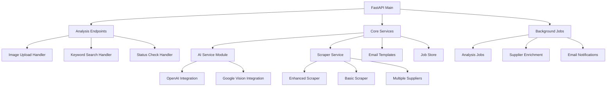

## API Endpoints Reference

### Authentication Endpoints

| Method | Endpoint                    | Description       | Auth Required |
| ------ | --------------------------- | ----------------- | ------------- |
| POST   | `/api/auth/login`           | User login        | No            |
| POST   | `/api/auth/register`        | User registration | No            |
| POST   | `/api/auth/logout`          | User logout       | Yes           |
| POST   | `/api/auth/refresh`         | Token refresh     | Yes           |
| POST   | `/api/auth/forgot-password` | Password reset    | No            |

### Part Analysis Endpoints

| Method | Endpoint                        | Description                  | Auth Required |
| ------ | ------------------------------- | ---------------------------- | ------------- |
| POST   | `/analyze-part`                 | Upload image for analysis    | No            |
| GET    | `/analyze-part/status/{job_id}` | Check analysis status        | No            |
| POST   | `/analyze-part/schedule`        | Schedule analysis with email | No            |
| POST   | `/search/keywords`              | Search by keywords           | No            |
| POST   | `/search/keywords/schedule`     | Schedule keyword search      | No            |

### User Management Endpoints

| Method | Endpoint               | Description          | Auth Required |
| ------ | ---------------------- | -------------------- | ------------- |
| GET    | `/api/user/profile`    | Get user profile     | Yes           |
| PUT    | `/api/user/profile`    | Update profile       | Yes           |
| GET    | `/api/history`         | Get analysis history | Yes           |
| GET    | `/api/dashboard/stats` | Get user statistics  | Yes           |

### Admin Endpoints

| Method | Endpoint                | Description            | Auth Required |
| ------ | ----------------------- | ---------------------- | ------------- |
| GET    | `/api/admin/users`      | List all users         | Admin         |
| GET    | `/api/admin/analytics`  | System analytics       | Admin         |
| PUT    | `/api/admin/settings`   | Update system settings | Super Admin   |
| GET    | `/api/admin/audit-logs` | View audit logs        | Admin         |

### Request/Response Schemas

#### Part Analysis Request

```typescript
interface AnalysisRequest {
  file: File; // Image file
  keywords?: string[]; // Optional keywords
  confidence_threshold?: number; // 0-100
  max_predictions?: number; // 1-10
  user_email?: string; // For notifications
}
```

#### Analysis Response

```typescript
interface AnalysisResponse {
  success: boolean;
  status: "processing" | "completed" | "failed";
  filename?: string;
  class_name?: string;
  category?: string;
  precise_part_name?: string;
  material_composition?: string;
  manufacturer?: string;
  confidence_score?: number;
  confidence_explanation?: string;
  estimated_price?: {
    new: string;
    used: string;
    refurbished: string;
  };
  description?: string;
  technical_data_sheet?: {
    part_type: string;
    material: string;
    common_specs: string;
    load_rating: string;
    weight: string;
    reusability: string;
    finish: string;
    temperature_tolerance: string;
  };
  compatible_vehicles?: string[];
  engine_types?: string[];
  buy_links?: Record<string, string>;
  suppliers?: SupplierInfo[];
  fitment_tips?: string;
  additional_instructions?: string;
  full_analysis?: string; // Markdown format
  processing_time_seconds?: number;
  model_version?: string;
  error?: string;
}
```

#### Supplier Information

```typescript
interface SupplierInfo {
  name: string;
  url: string;
  price_range?: string;
  shipping_region?: string;
  contact?: string;
  contact_info?: {
    emails: string[];
    phones: string[];
    addresses: string[];
    business_hours?: string;
    social_media?: Record<string, string>;
    contact_links?: string[];
  };
  company_name?: string;
  description?: string;
  price_info?: string;
  scraping_success?: boolean;
  scraping_error?: string;
}
```

## Data Models & Database Schema

### Core Tables Structure

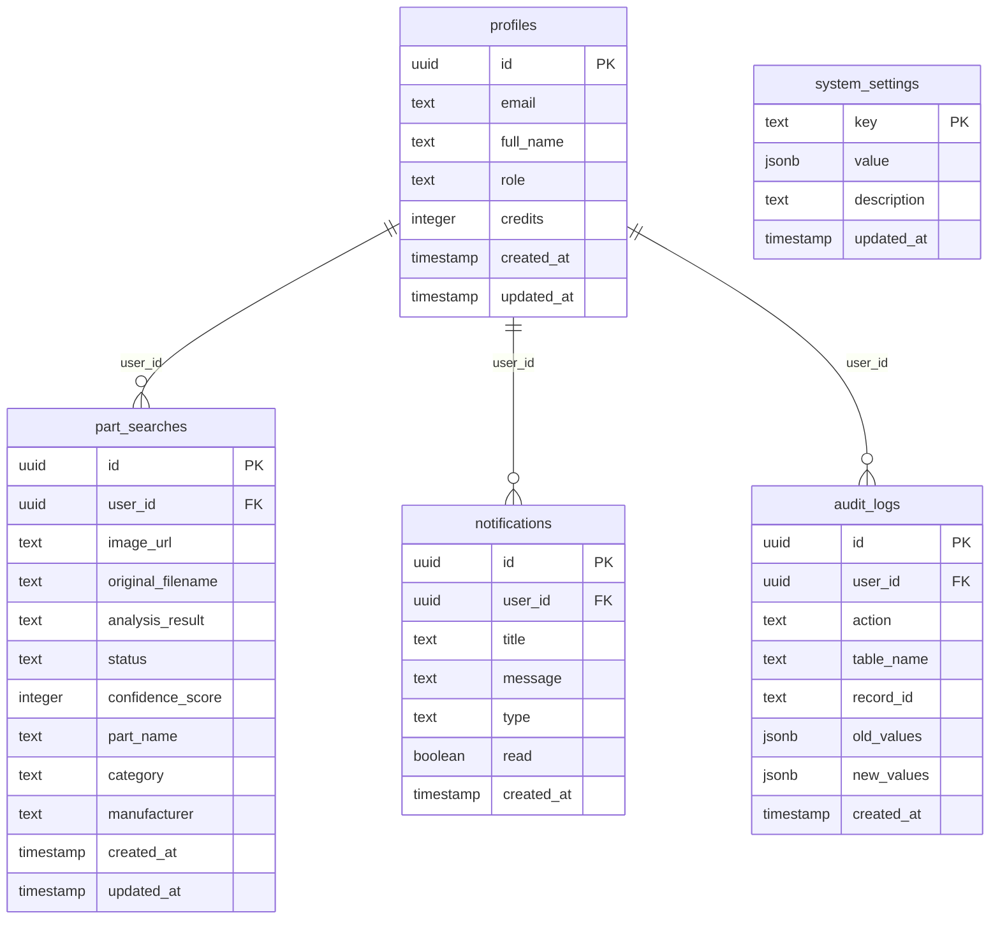

### Database Integration Patterns

#### Supabase Client Usage

```typescript
// Backend service initialization
export const supabase = createClient(
  process.env.SUPABASE_URL!,
  process.env.SUPABASE_SERVICE_KEY!
);

// User profile management
const getUserProfile = async (userId: string) => {
  const { data, error } = await supabase
    .from("profiles")
    .select("*")
    .eq("id", userId)
    .single();

  if (error) throw error;
  return data;
};

// Part search storage
const savePartSearch = async (searchData: PartSearchData) => {
  const { data, error } = await supabase
    .from("part_searches")
    .insert(searchData)
    .select()
    .single();

  if (error) throw error;
  return data;
};
```

## Web Scraping & Intelligence Layer

### Scraping Architecture

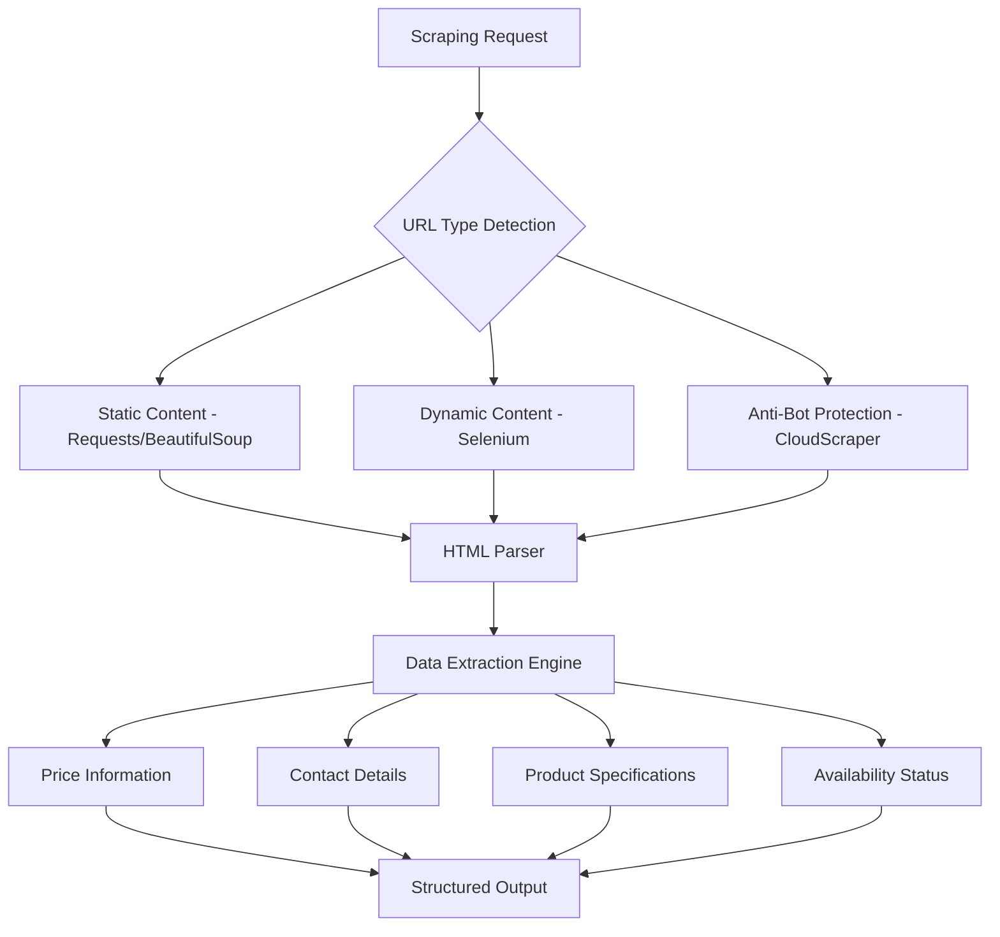

### Enhanced Scraping Capabilities

#### Multi-Source Scraping

The system implements intelligent web scraping with multiple strategies:

1. **Static Content Scraping**

   - Uses `requests` + `BeautifulSoup4` for basic HTML parsing
   - Handles simple product pages and catalogs
   - Fast execution for standard websites

2. **Dynamic Content Handling**

   - Selenium WebDriver for JavaScript-heavy sites
   - Handles React/Vue/Angular applications
   - Simulates user interactions for content loading

3. **Anti-Bot Bypass**
   - CloudScraper for Cloudflare protection bypass
   - Fake User-Agent rotation
   - Request throttling and session management

#### Supplier Enrichment Process

```python
async def scrape_multiple_suppliers(urls: List[str]) -> List[Dict]:
    """
    Enriches supplier information from multiple URLs
    Extracts: contact info, pricing, company details
    """
    results = []
    for url in urls:
        try:
            # Multi-strategy scraping approach
            data = await enhanced_scrape_supplier_page(url)
            results.append({
                "success": True,
                "url": url,
                "contact": data.get("contact", {}),
                "company_name": data.get("company_name"),
                "description": data.get("description"),
                "price_info": data.get("price_info"),
                "scraping_method": data.get("method")
            })
        except Exception as e:
            results.append({
                "success": False,
                "url": url,
                "error": str(e)
            })
    return results
```

#### Contact Information Extraction

The scraping engine automatically extracts:

- **Email addresses**: Pattern matching and mailto: links
- **Phone numbers**: International format recognition
- **Physical addresses**: Geographic location parsing
- **Business hours**: Operating schedule extraction
- **Social media**: Platform profile detection
- **Contact forms**: Form endpoint identification

### AI Integration with Scraping

#### Two-Stage Analysis Process

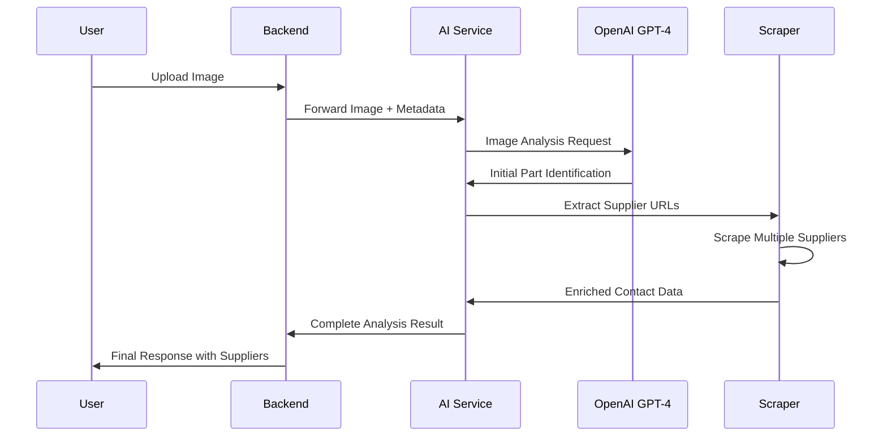

1. **AI-Powered Initial Analysis**

   - OpenAI GPT-4 Vision identifies the part
   - Extracts supplier URLs from AI response
   - Generates technical specifications

2. **Intelligent Supplier Enrichment**
   - Scrapes extracted supplier websites
   - Enriches contact information
   - Validates pricing and availability
   - Consolidates multi-source data

## Business Logic Layer

### User Management Architecture

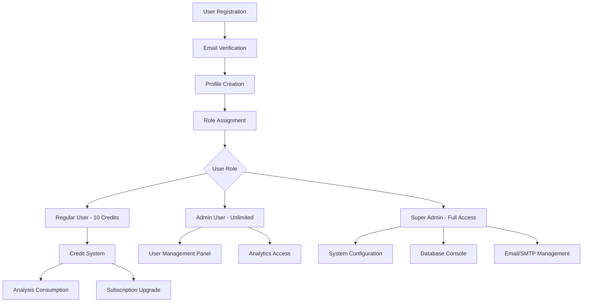

### Credit System Implementation

```typescript
interface CreditTransaction {
  user_id: string;
  amount: number; // Negative for consumption
  type: "analysis" | "subscription" | "bonus" | "refund";
  description: string;
  analysis_id?: string;
}

const consumeCredits = async (userId: string, amount: number) => {
  const { data: profile } = await supabase
    .from("profiles")
    .select("credits")
    .eq("id", userId)
    .single();

  if (profile.credits < amount) {
    throw new Error("Insufficient credits");
  }

  // Atomic credit deduction
  await supabase.rpc("deduct_credits", {
    user_id: userId,
    amount: amount,
  });
};
```

### Analysis Workflow Engine

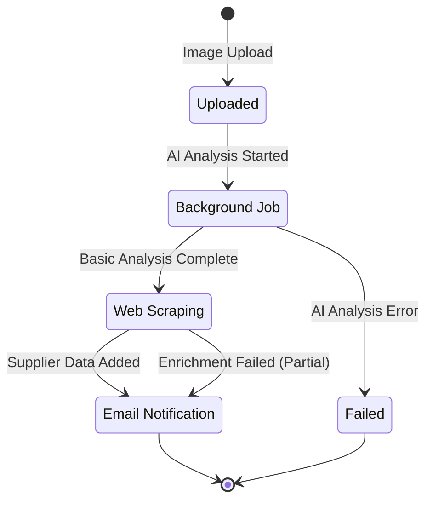

### Email Notification System

The platform includes a comprehensive email system:

1. **Analysis Started Notifications**

   - Confirms job submission
   - Provides tracking information
   - Estimated completion time

2. **Analysis Completed Notifications**

   - Rich HTML email with results
   - Embedded charts and data visualization
   - Direct links to detailed analysis

3. **Keyword Search Notifications**

   - Search results with part matches
   - Supplier recommendations
   - Pricing comparisons

4. **Administrative Notifications**
   - System alerts and monitoring
   - User activity summaries
   - Performance metrics

## Middleware & Security

### Security Implementation

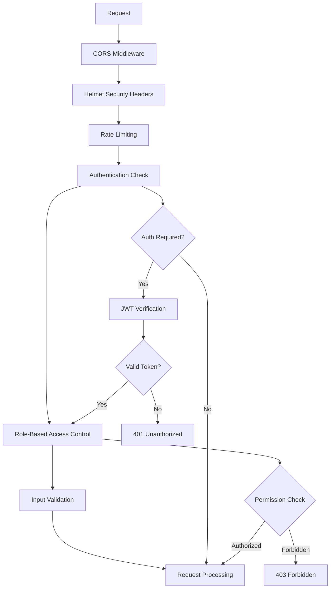

### Authentication Flow

```typescript
// JWT Authentication Middleware
const authenticateToken = async (req, res, next) => {
  const authHeader = req.headers["authorization"];
  const token = authHeader && authHeader.split(" ")[1];

  if (!token) {
    return res.status(401).json({ error: "Access token required" });
  }

  try {
    const {
      data: { user },
      error,
    } = await supabase.auth.getUser(token);
    if (error) throw error;

    req.user = user;
    next();
  } catch (error) {
    return res.status(403).json({ error: "Invalid or expired token" });
  }
};

// Role-based access control
const requireRole = (role: string) => {
  return async (req, res, next) => {
    const { data: profile } = await supabase
      .from("profiles")
      .select("role")
      .eq("id", req.user.id)
      .single();

    if (profile.role !== role && profile.role !== "super_admin") {
      return res.status(403).json({ error: "Insufficient permissions" });
    }

    next();
  };
};
```

### CORS Configuration

```typescript
const corsOptions = {
  origin: function (origin, callback) {
    const allowedOrigins = [
      "http://localhost:5173",
      "http://localhost:3000",
      "https://sparefinder.org",
      "https://www.sparefinder.org",
      "https://part-finder-ai-vision.netlify.app",
    ];

    if (!origin || allowedOrigins.indexOf(origin) !== -1) {
      callback(null, true);
    } else {
      callback(new Error("Not allowed by CORS"));
    }
  },
  credentials: true,
  methods: ["GET", "POST", "PUT", "DELETE", "PATCH", "OPTIONS"],
};
```

## Testing Strategy

### Frontend Testing Architecture

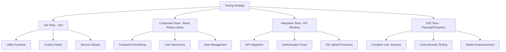

### Backend Testing Structure

```typescript
// API Route Testing Example
describe("Part Analysis API", () => {
  beforeEach(async () => {
    // Setup test database
    await setupTestDB();
  });

  test("POST /analyze-part - successful image analysis", async () => {
    const mockFile = new FormData();
    mockFile.append("file", testImageBuffer, "test-part.jpg");

    const response = await request(app)
      .post("/analyze-part")
      .attach("file", mockFile)
      .expect(200);

    expect(response.body.success).toBe(true);
    expect(response.body.status).toBe("processing");
    expect(response.body.filename).toBeTruthy();
  });

  test("Authentication middleware protection", async () => {
    await request(app).get("/api/dashboard/stats").expect(401);
  });
});
```

### AI Service Testing

```python
# FastAPI Testing Example
@pytest.mark.asyncio
async def test_image_analysis():
    """Test AI service image analysis endpoint"""

    # Mock OpenAI response
    with patch('openai.ChatCompletion.create') as mock_openai:
        mock_openai.return_value = {
            'choices': [{'message': {'content': 'Mock part analysis'}}]
        }

        # Test image upload
        files = {'file': ('test.jpg', test_image_bytes, 'image/jpeg')}
        response = await client.post('/analyze-part', files=files)

        assert response.status_code == 200
        assert response.json()['success'] == True

@pytest.mark.asyncio
async def test_supplier_scraping():
    """Test web scraping functionality"""

    # Mock HTTP response
    with patch('aiohttp.ClientSession.get') as mock_get:
        mock_get.return_value.__aenter__.return_value.text.return_value = mock_html

        result = await scrape_supplier_page('https://example.com')

        assert result['success'] == True
        assert 'contact' in result
        assert 'company_name' in result
```

This SpareFinderAI platform represents a sophisticated full-stack application that combines modern web technologies with advanced AI capabilities and intelligent web scraping to provide comprehensive automotive part identification services.
