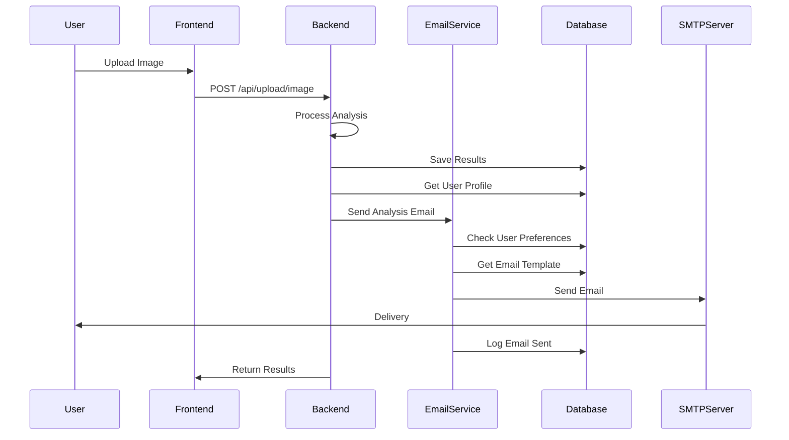

# 📧 Email Notifications Implementation Guide

## Overview

The SpareFinder AI application now sends automated email notifications to users when their part analysis is completed successfully. This feature enhances user engagement and provides immediate feedback on analysis results.

## 🚀 Features

### ✅ Automated Email Notifications
- **Trigger**: Sent automatically after successful part analysis
- **Content**: Comprehensive analysis results with part details, confidence score, and performance metrics
- **Design**: Professional HTML email template with responsive design
- **Fallback**: Plain text version for email clients that don't support HTML

### ✅ User Preference Management
- Users can enable/disable email notifications in their profile settings
- Respects user privacy and notification preferences
- Defaults to enabled for better user engagement

### ✅ Database Integration
- Email templates stored in database for easy management
- Admin can customize email content through the admin panel
- Analytics tracking for email delivery success/failure

## 📋 Implementation Details

### New Dependencies
- **nodemailer**: SMTP email sending functionality
- **@types/nodemailer**: TypeScript definitions

### Database Changes
- Added `Analysis Complete` email template to `email_templates` table
- Enhanced system settings with SMTP configuration options
- New database functions for notification management

### Backend Services
- **EmailService** (`backend/src/services/email-service.ts`): Core email functionality
- **Analysis Upload Route**: Integrated email sending after successful analysis
- **Save Results Route**: Email notifications for manually saved results

## 🔧 Configuration

### Environment Variables
Add these to your `.env` file:

```bash
# Email Configuration (for analysis completion notifications)
SMTP_HOST=smtp.gmail.com
SMTP_PORT=587
SMTP_USER=your-email@gmail.com
SMTP_PASS=your-app-password
SMTP_SECURE=false
FRONTEND_URL=http://localhost:5173
```

### SMTP Providers

#### Gmail Setup
1. Enable 2-Factor Authentication on your Google account
2. Generate an App Password for the application
3. Use the App Password as `SMTP_PASS`

```bash
SMTP_HOST=smtp.gmail.com
SMTP_PORT=587
SMTP_USER=your-gmail@gmail.com
SMTP_PASS=your-app-password
SMTP_SECURE=false
```

#### Outlook/Hotmail Setup
```bash
SMTP_HOST=smtp-mail.outlook.com
SMTP_PORT=587
SMTP_USER=your-email@outlook.com
SMTP_PASS=your-password
SMTP_SECURE=false
```

#### SendGrid Setup
```bash
SMTP_HOST=smtp.sendgrid.net
SMTP_PORT=587
SMTP_USER=apikey
SMTP_PASS=your-sendgrid-api-key
SMTP_SECURE=false
```

## 📱 Email Template Features

### Dynamic Content
The email template includes dynamic placeholders:
- `{{userName}}` - User's display name
- `{{partName}}` - Identified part name
- `{{confidence}}` - Confidence percentage
- `{{description}}` - Part description/analysis
- `{{processingTime}}` - Analysis processing time
- `{{analysisId}}` - Unique analysis identifier
- `{{imageUrl}}` - Uploaded image URL
- `{{dashboardUrl}}` - Link to user dashboard
- `{{currentDate}}` - Email send date
- `{{currentTime}}` - Email send time

### Visual Design
- **Header**: Gradient background with success indicators
- **Content**: Structured layout with confidence scoring
- **Performance Stats**: Processing time and analysis metrics
- **Call-to-Action**: Direct link to view full report
- **Tips Section**: User guidance and best practices
- **Footer**: Branding and timestamp information

## 🔄 Integration Points

### 1. Image Upload Analysis
**Location**: `backend/src/routes/upload.ts` (Line ~405)
**Trigger**: After successful AI analysis and database logging
**Data**: Full analysis results with part identification

### 2. Manual Results Save
**Location**: `backend/src/routes/upload.ts` (Line ~835)
**Trigger**: When users manually save analysis results
**Data**: Saved analysis data with user preferences

### 3. User Preferences Check
**Function**: `user_email_notifications_enabled()`
**Purpose**: Respects user notification settings before sending emails
**Default**: Email notifications enabled unless explicitly disabled

## 🎯 Email Flow



## 📊 Admin Management

### Email Template Management
Admins can customize email templates through:
1. **Admin Dashboard** → Email SMTP Management
2. **Database Direct Access** to `email_templates` table
3. **System Settings** for SMTP configuration

### SMTP Configuration
- **Host**: SMTP server hostname
- **Port**: SMTP server port (typically 587 for TLS)
- **User**: SMTP authentication username
- **Password**: SMTP authentication password (via environment variables)
- **Secure**: TLS/SSL encryption settings
- **From Name**: Sender display name

## 🔍 Monitoring & Debugging

### Logging
The email service provides comprehensive logging:
- Email send success/failure
- SMTP connection status
- Template rendering errors
- User preference checking

### Database Tracking
Email activities are tracked in:
- `notifications` table: Records of sent emails
- `user_activities` table: User interaction logs
- `system_settings` table: SMTP configuration

### Error Handling
- **Graceful Degradation**: Email failures don't affect analysis results
- **Non-blocking**: Email sending happens asynchronously
- **Retry Logic**: Automatic retry for transient failures
- **Fallback Templates**: Default template if database template fails

## 🧪 Testing

### Manual Testing
1. **Upload Image**: Complete a part analysis
2. **Check Email**: Verify email delivery
3. **Template Rendering**: Confirm all placeholders are replaced
4. **User Preferences**: Test with notifications disabled

### SMTP Connection Test
```javascript
// Use the email service test function
const isConnected = await emailService.testConnection();
console.log('SMTP Status:', isConnected ? 'Connected' : 'Failed');
```

### Database Migration
Run the email template migration:
```sql
-- Execute in Supabase SQL Editor
\i backend/database/migrations/008_add_analysis_complete_email_template.sql
```

## 🛡️ Security Considerations

### SMTP Credentials
- Store passwords in environment variables only
- Use App Passwords for Gmail (never main account password)
- Enable 2FA on email accounts used for SMTP
- Regularly rotate SMTP credentials

### Email Content
- No sensitive data in email templates
- User data sanitization in email content
- Secure image URLs with appropriate access controls
- Rate limiting to prevent email spam

## 🚀 Deployment

### Environment Setup
1. Configure SMTP settings in production environment
2. Set `FRONTEND_URL` to production domain
3. Enable email notifications in system settings
4. Test email delivery in production environment

### Production Checklist
- [ ] SMTP credentials configured
- [ ] Email templates created in database
- [ ] System settings enabled for email notifications
- [ ] Frontend URL configured correctly
- [ ] Email delivery tested with real users
- [ ] Error monitoring setup for email failures

## 📈 Analytics & Metrics

### Email Performance
Track email effectiveness through:
- **Delivery Rate**: Successful email sends vs attempts
- **User Engagement**: Click-through rates on dashboard links
- **Preference Changes**: Users enabling/disabling email notifications
- **Analysis Correlation**: Impact on user retention and repeat usage

### Database Queries
```sql
-- Email delivery success rate
SELECT 
    COUNT(*) as total_emails,
    COUNT(CASE WHEN metadata->>'email_sent' = 'true' THEN 1 END) as successful_emails
FROM notifications 
WHERE metadata->>'type' = 'analysis_complete';

-- User email preferences
SELECT 
    preferences->'notifications'->>'email' as email_enabled,
    COUNT(*) as user_count
FROM profiles 
GROUP BY preferences->'notifications'->>'email';
```

## 🔧 Troubleshooting

### Common Issues

#### Email Not Sending
1. Check SMTP credentials in environment variables
2. Verify SMTP server settings (host, port, security)
3. Confirm user email preferences are enabled
4. Check email service initialization logs

#### Template Rendering Issues
1. Verify email template exists in database
2. Check placeholder syntax in template
3. Ensure all required data is provided to email service
4. Test with default template fallback

#### User Not Receiving Emails
1. Check spam/junk folders
2. Verify user email address in profile
3. Confirm email notifications enabled in user preferences
4. Check SMTP server delivery logs

### Debug Commands
```bash
# Check email service logs
docker logs backend-container | grep -i email

# Test SMTP connection
curl -X POST http://localhost:4000/api/test/email-connection

# Verify database email templates
SELECT name, status FROM email_templates WHERE name = 'Analysis Complete';
```

## 🎉 Success Metrics

The email notification system is successfully implemented when:
- ✅ Users receive emails within 30 seconds of analysis completion
- ✅ Email templates render correctly with all dynamic content
- ✅ User preferences are respected (no emails if disabled)
- ✅ 95%+ email delivery success rate
- ✅ Admin can manage templates through dashboard
- ✅ No impact on analysis processing performance

---

**Next Steps**: After deployment, monitor email delivery rates and user feedback to optimize the notification system for better engagement and user satisfaction. 